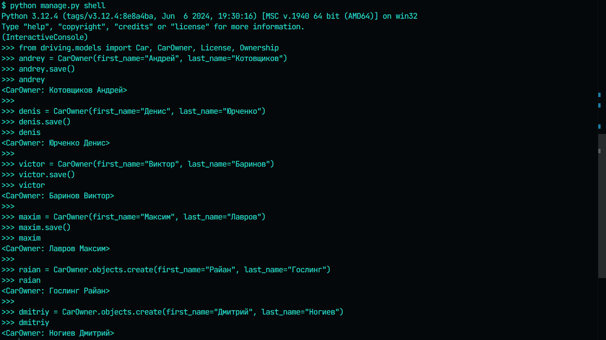
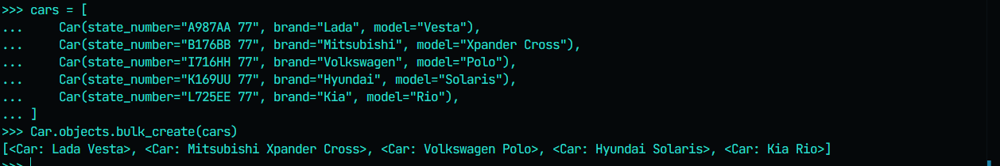
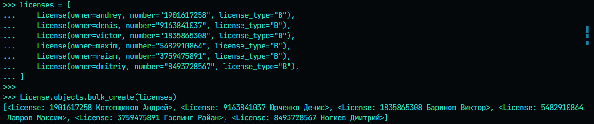
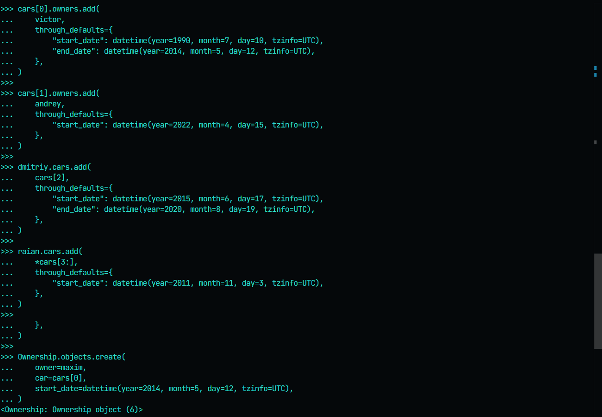
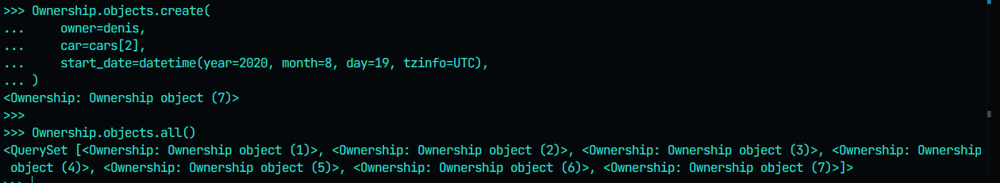
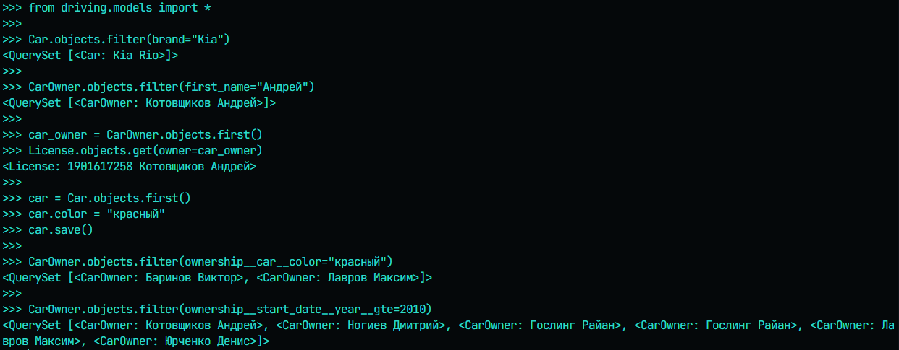
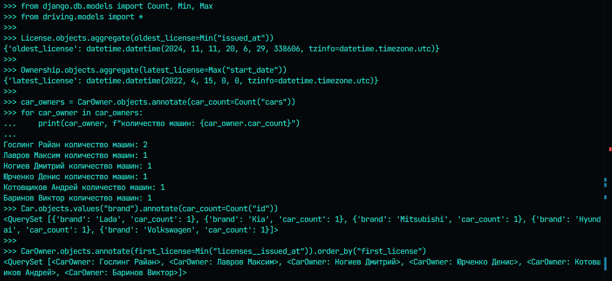

# Практическая работа №3.1. Django Web framework. Запросы и их выполнение

---

## Запуск интерактивного режима

1. Активируем вертуальное окружение

```
source .venv/Scripts/activate
```

2. Открываем shell

```
python manage.py shell
```

## Практическое задание 1

1. Запросы на добавление автовладельцев
   
2. Запросы на добавление автомобилей
   
3. Запросы на добавление лицензий для автовладельцев
   
4. Запросы на добавление автомобилей автовладельцам
   
   

## Практическое задание 2



## Практическое задание 3


