# Лабораторная работа 3. Реализация серверной части на django rest. Документирование API.

---

## **Описание endpoint-ов из задания**

Получить информацию о клиентах, проживавших в заданном номере, в заданный период времени

```
GET /hotel/rooms/<id номера>/guests/
```

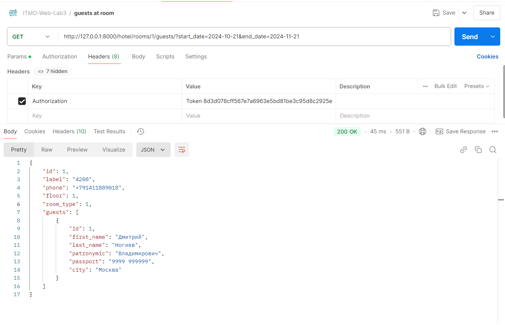

Получить информацию о клиентах, прибывших из заданного города

```
GET /hotel/guests/
```

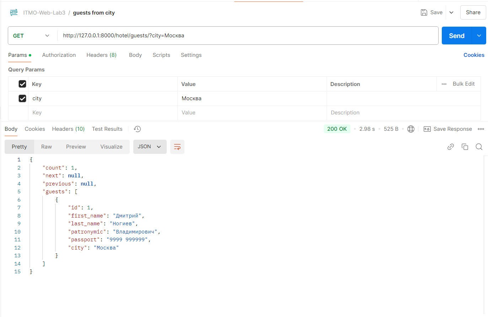

Получить информацию о том, кто из служащих убирал номер указанного клиента в заданный день недели

```
GET /hotel/employees/
```

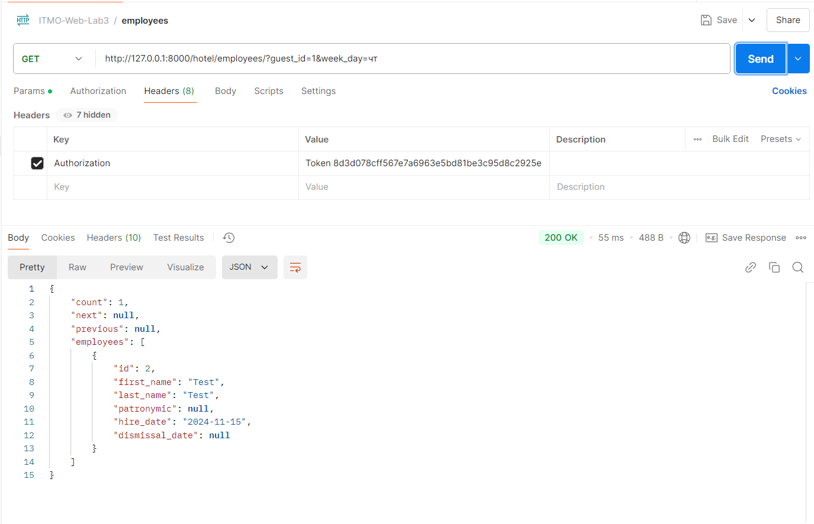

Получить информацию о свободных номерах в гостинице

```
GET /hotel/rooms/
```

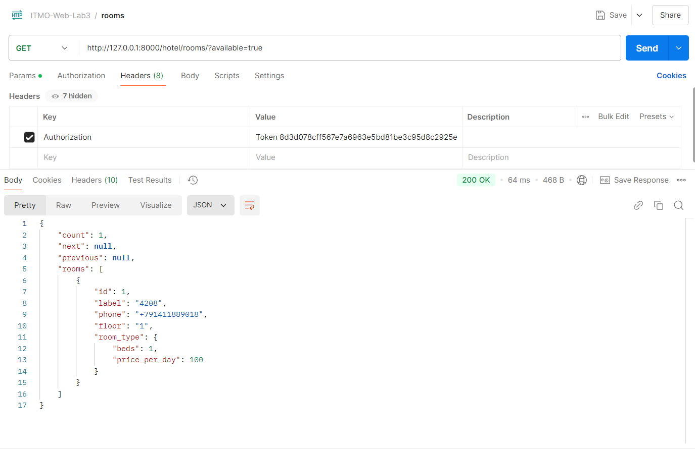

Получить список клиентов с указанием места жительства, которые проживали в те же дни,
что и заданный клиент, в определенный период времени

```
GET /hotel/guests/<id заданного клиента>/overlapping/
```

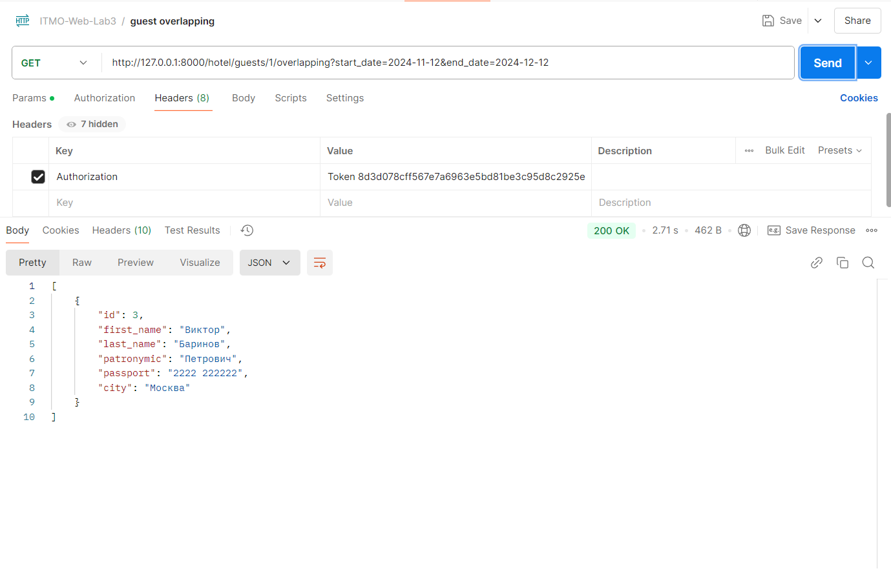

Принять на работу сотрудника

```
POST /hotel/employees/
```

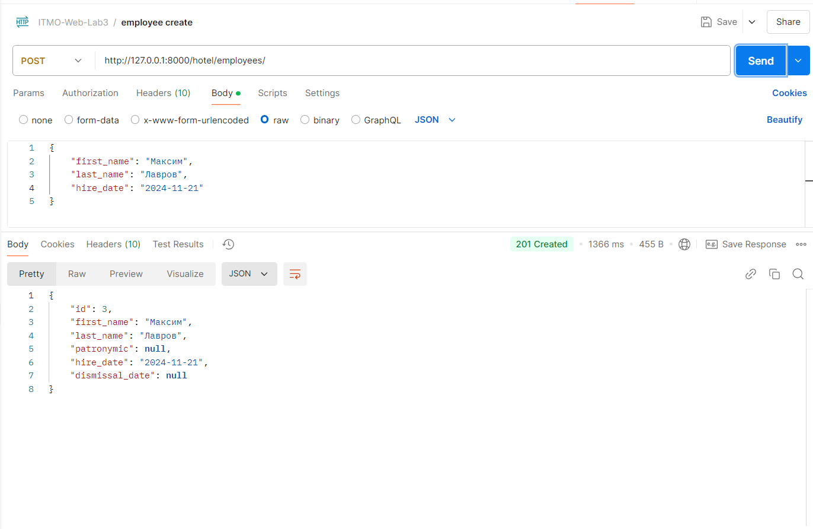

Изменить информацию о сотруднике (уволить)

```
PUT /hotel/employees/<id сотрудника>/
```

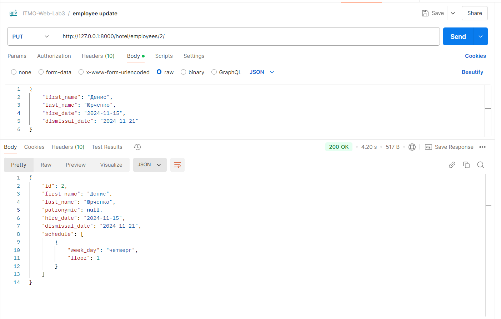

Создать расписание для сотрудника

```
POST /hotel/employees/<id сотрудника>/schedule/
```

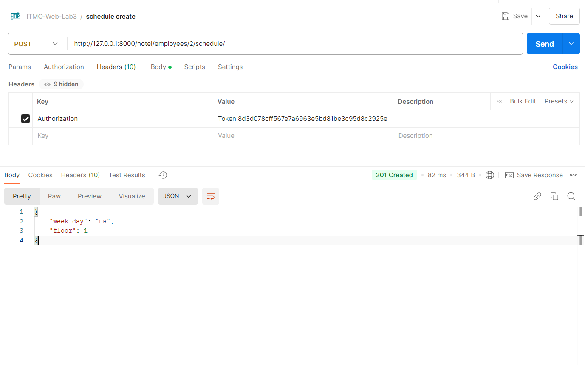

Сбросить расписание сотрудника

```
DELETE /hotel/employees/<int:pk>/schedule/reset/
```

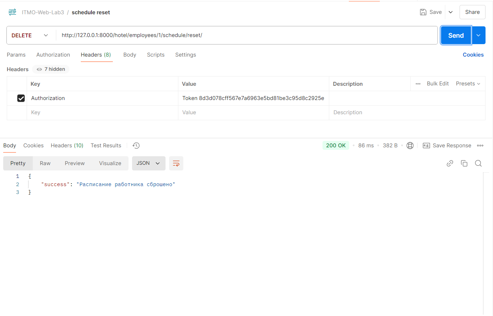

Внести информацию о клиенте

```
POST /hotel/guests/
```

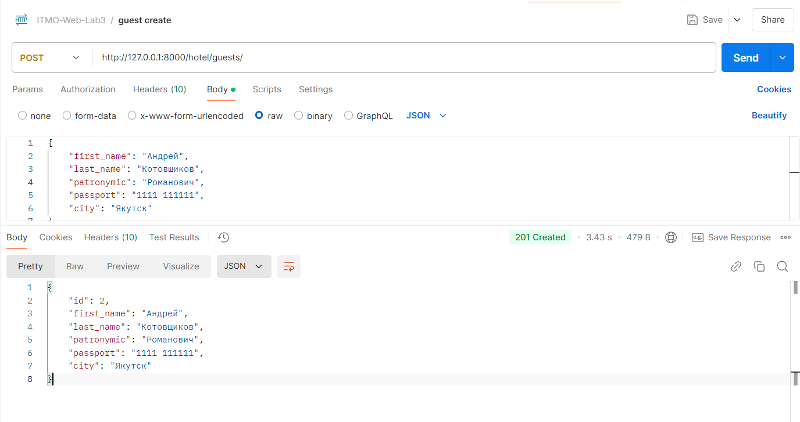

Поселить клиента в номер

```
POST /hotel/rooms/<id номера>/booking/
```

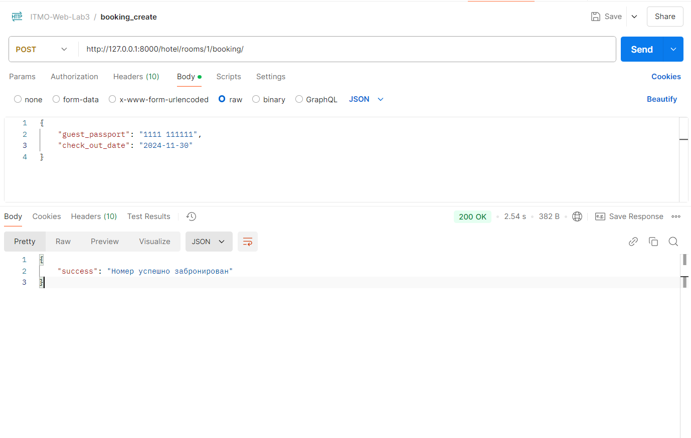

Освободить номер (выселить проживающего в данный момент клиента)

```
DELETE /hotel/rooms/<id номера, который нужно освободить>/booking/
```

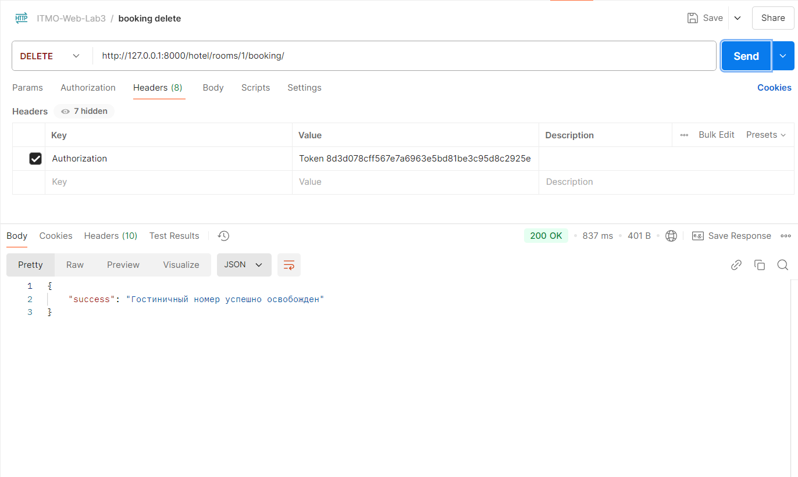

Сформировать отчет за квартал текущего года, содежащий:

1. число клиентов за указанный период в каждом номере;
2. количество номеров не каждом этаже;
3. общая сумма дохода за каждый номер;
4. суммарный доход по всей гостинице.

```
GET /hotel/reports/<номер квартала от 1 до 4 включительно>/
```

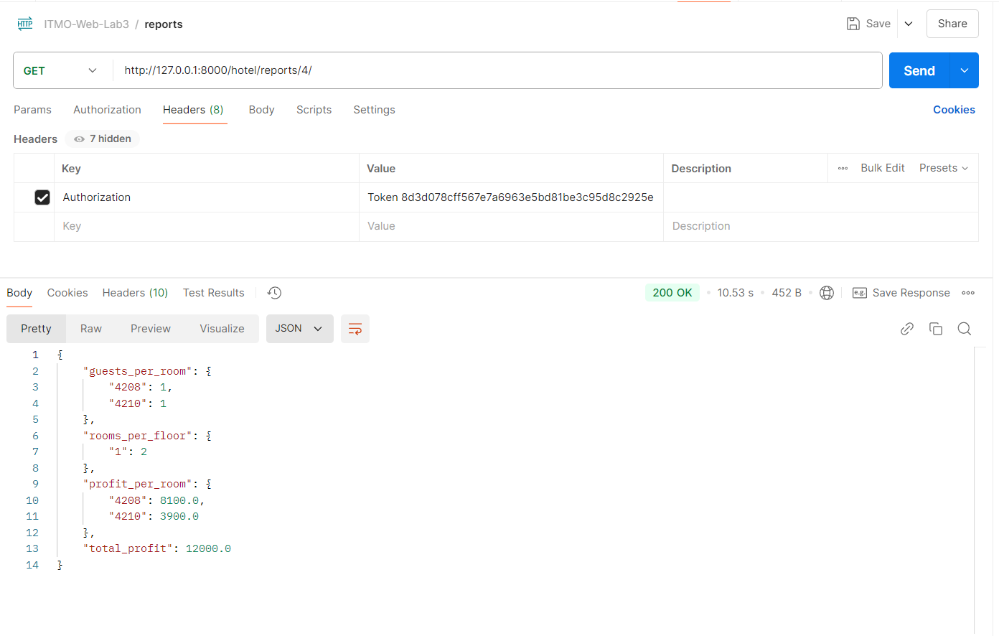

## **Подключение Djoser**

Регистрация

```
POST /auth/users/
```

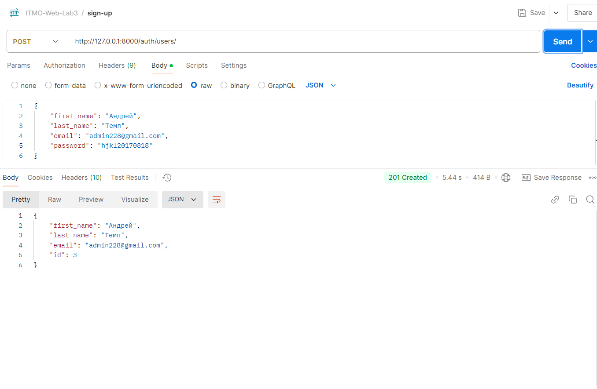

Получение токена

```
POST /auth/token/login/
```


Получение информации о текущем пользователе

```
GET /auth/users/me/
```

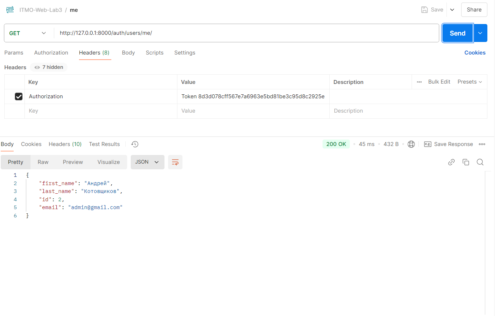
