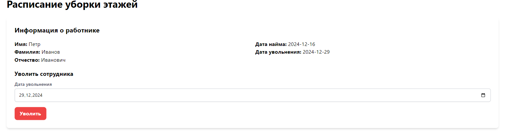

# Лабораторная работа 4. Лабораторная работа 4. Реализация клиентской.

---

## 1. **Настройка политики CORS**

Первым делом в рамках лабораторной работы номер 4 была настроена политика CORS, регламентирующая
правила отправки запросов между разными хостами (в моем случае frontend имеет адрес localhost:4200 а backend 127.0.0.1:8000).

Регистрируем **corsheaders** в INSTALLED_APPS:


Затем добавляем **CorsMiddleware** в MIDDLEWARE:


И последним шагом добавляем настройку CORS_ALLOWED_ORIGINS, где указываем
**ALLOWED_HOSTS** (в нашем случае localhost:4200):


## 2. **Регистрация и авторизация**

Для регистрации администратора гостиницы была создана форма с нужными полями, после заполнения
которой приложение отправляет запрос на endpoint:

```curl
POST /auth/users/
```


После успеной регистрации мы попадаем на страницу авторизации:


В случае ввода неверного логина (email) или пароля вывыдется специальное сообщение:


После ввода корректных данных и отправки формы сервер вернет нам токен, который будет сохранен в **LocalStorage** для того, чтобы в будущем можно было использовать его для аутентификации при отправке прочих запросов.


## 3. **Формирование отчета**

На странице с формированием отчета присутствует **селектор** для выбора квартала, за который
мы хотим сформировать отчет:


После выбора квартала и нажатия кнопки у нас внизу появится отчет в виде таблицы:


## 4. **Список сотрудников**

При выборе соответсвующего пункта меня в навигации мы попадем на
страницу с отображением списка из карточек сотрудников гостиницы:


При клике на карточку мы перейдем на детальную страницу работника, где
можно посмотреть и изменить его расписание.

## 5. **Редактирование и просмотр информации о работнике**

На детальной странице работника мы можем сбросить его расписани либо
указать в какой день недели он убирает соответсвующий этаж. В специальной таблице формируется полное
расписание работника.


В случае обнаружения пересечений в расписании система нас предупредит:


Также мы можем уволить работника, указав соответсвующую дату:



## 6. **Список гостей**

Помимо списка работников мы можем также посмотреть список гостей и отфильтовать их
по нужному городу:


## 7. **Бронирование номеров**

При переходе на специальную страницу мы увидим информацию обо всех
гостиничных номерах:


При необходимости можно выбрать только свободные намера, нажав на checkbox:


При нажатии на карточку с номером открывается модальное окно, где нужно
указать серию и номер паспорта гостя и дату планируемого выселения. После ввода
всех необходимых данных номер будет успешно забронирован:


Если обнаружится пересечение брони с другим клиентом выведется сообщение об ошибке:


